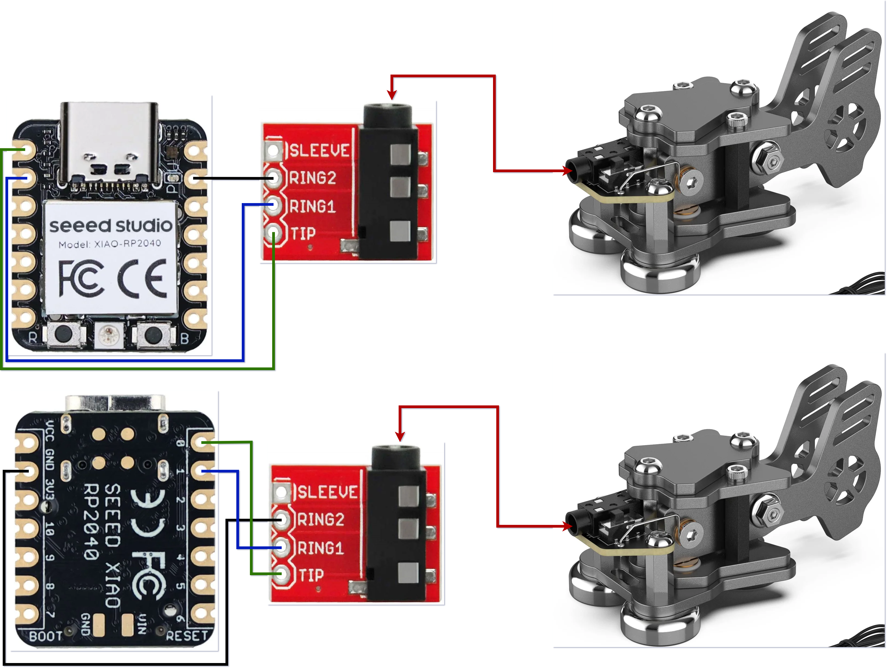
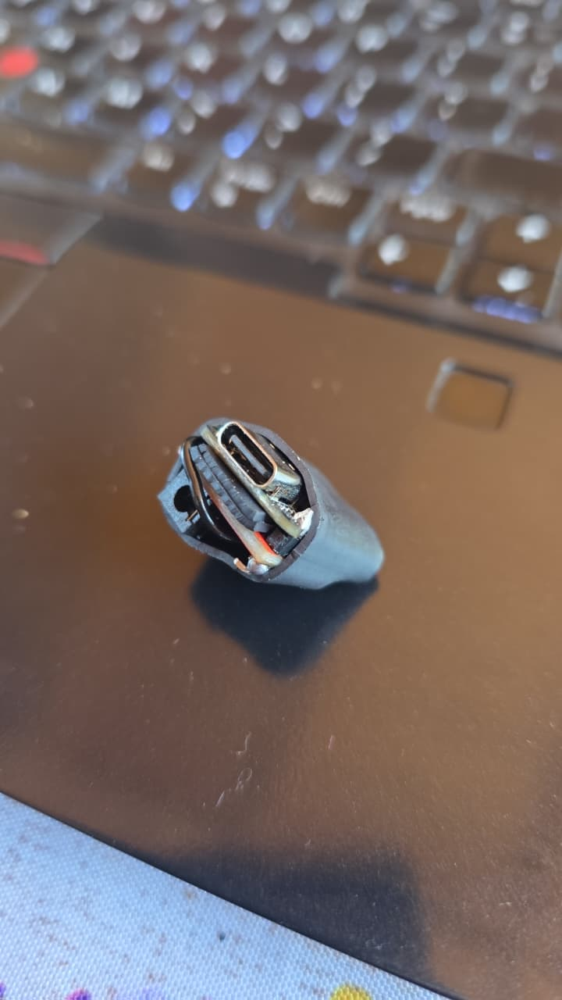

# Morse-vBand

[](https://wiki.seeedstudio.com/XIAO-RP2040/)
[](https://www.arduino.cc/)
[](#usb-hid-output)
[](https://github.com/frrojas92/Morse-vBand-LAN)
[](https://github.com/frrojas92/Morse-vBand/commits/main)

**USB HID interface for Morse code training using a physical paddle and a Seeed Studio XIAO RP2040.**

Morse-vBand is conceived as a **Simple Morse code / CW training interface**, allowing a real dual-lever paddle to be used with web and Android training applications.

The project converts a dual-lever Morse paddle into a standard USB HID keyboard interface for **vBand**, **Morse-vBand-LAN**, and compatible Android apps, providing a simple and portable way to practice CW with real paddle hardware.

The XIAO reads the paddle contacts and sends:

- **Left paddle / DIT (`.`)** → `Left Ctrl`
- **Right paddle / DAH (`-`)** → `Right Ctrl`

The **WPM, keyer mode and Morse timing are handled by the training application**, so the firmware does not need to be reconfigured when changing speed.

> **Purpose:** Morse-vBand is primarily designed for **learning, practicing and improving Morse code (CW) skills using a real physical paddle**.

[](https://github.com/frrojas92/Morse-vBand/blob/main/Diagrama.drawio.png)
[](https://github.com/frrojas92/Morse-vBand/blob/main/1.jpeg)

## Features

- Designed specifically for **Morse code / CW training**
- Practice with a **real dual-lever paddle**
- Seeed Studio **XIAO RP2040**
- USB HID keyboard — no special driver required
- Dual-paddle input with debounce
- Compatible with **vBand**
- Compatible with **Morse-vBand-LAN** for multi-operator CW practice on a local network
- Compatible with Android via USB OTG
- On-board RGB status LED
- WPM controlled by the training application
- Simple, portable and low-cost hardware

## Compatible software

- **Morse-vBand-LAN** — offline-first, multi-operator CW training over a trusted local network. The application recognizes the firmware's `Left Ctrl` DIT and `Right Ctrl` DAH output without additional drivers or firmware changes. WPM, keyer mode, sidetone, rooms, decoding, and instructor controls are handled by the web application.

  [Morse-vBand-LAN on GitHub](https://github.com/frrojas92/Morse-vBand-LAN)

- **vBand** — web-based CW keyer and training platform

  [vBand](https://hamradio.solutions/vband/)

- **Morse Training: Learn Morse** for Android — supports physical paddles through USB keyboard adapters

  [Google Play](https://play.google.com/store/apps/details?id=com.qft8.morsekeyer)

## RGB status

| State | LED |
|---|---|
| Idle | 🔵 Blue |
| DIT / Left paddle | 🟢 Green |
| DAH / Right paddle | 🔴 Red |
| Both paddles | 🟣 Violet |

## Bill of Materials

| Qty | Component |
|---:|---|
| 1 | Seeed Studio XIAO RP2040 |
| 1 | Dual-lever Morse paddle / Putikeeg |
| 1 | 3.5 mm TRRS breakout module |
| 1 | 3.5 mm paddle cable |
| 3 | Jumper wires / hookup wire |
| 1 | USB-C data cable |
| Optional | USB-C OTG adapter/cable for Android |

## Wiring

The wiring below corresponds to the tested hardware configuration used in this project.

| TRRS module | XIAO RP2040 | Function |
|---|---|---|
| `TIP` | `D0` | Right paddle / DAH |
| `RING1` | `D1` | Left paddle / DIT |
| `RING2` | `GND` | Common |
| `SLEEVE` | — | Not connected |

> Do **not** connect the paddle to `3V3` or `5V`. The firmware uses the RP2040 internal pull-up resistors (`INPUT_PULLUP`).

## Firmware installation

### 1. Install Arduino CLI

On Arch Linux / Omarchy:

```bash
sudo pacman -S arduino-cli
arduino-cli config init
```

### 2. Add RP2040 board support

```bash
arduino-cli config add board_manager.additional_urls \
https://github.com/earlephilhower/arduino-pico/releases/download/global/package_rp2040_index.json

arduino-cli core update-index
arduino-cli core install rp2040:rp2040
```

### 3. Install the NeoPixel library

```bash
arduino-cli lib install "Adafruit NeoPixel"
```

### 4. Connect the XIAO

Check that the board is detected:

```bash
arduino-cli board list
```

Typical port:

```text
/dev/ttyACM0
```

### 5. Compile

From the repository directory:

```bash
arduino-cli compile \
  --fqbn rp2040:rp2040:seeed_xiao_rp2040 \
  .
```

### 6. Upload

```bash
arduino-cli upload \
  -p /dev/ttyACM0 \
  --fqbn rp2040:rp2040:seeed_xiao_rp2040 \
  .
```

## USB HID output

Morse-vBand is intended to provide a more realistic CW training experience by allowing the operator to practice with the same type of physical paddle used in amateur radio operation.

The XIAO acts only as the interface between the paddle and the training software. The application is responsible for keyer timing, WPM and CW behavior.

### vBand

1. Connect the XIAO to the PC.
2. Open **vBand**.
3. Select the paddle/keyer mode.
4. Set the desired **WPM in vBand**.
5. Use the paddle normally.

### Android

1. Connect the XIAO to the Android phone/tablet using USB OTG.
2. Open **Morse Training: Learn Morse**.
3. Select the external/hardware paddle input.
4. Configure the desired WPM and keyer mode in the app.
5. Use the physical paddle normally.

The host sees the XIAO as a standard USB HID keyboard:

```text
Left paddle  → DIT → Left Ctrl
Right paddle → DAH → Right Ctrl
```

No WPM value is stored in the XIAO.

### Morse-vBand-LAN

1. Connect the Morse-vBand device to the computer or compatible mobile device.
2. Open the student interface provided by a running Morse-vBand-LAN server.
3. Enter a callsign and join a channel.
4. Select the keyer mode unless the instructor has enforced one.
5. Use the paddle normally. The application handles CW timing and generates the sidetone locally.

See the [Morse-vBand-LAN documentation](https://github.com/frrojas92/Morse-vBand-LAN#readme) for server and Docker setup.

## Acknowledgements

Special thanks to **Luis Quesada, HB9IPH**, developer of **Morse Training: Learn Morse**, for providing a free, ad-free Android Morse training/keyer application with support for external physical paddles over USB HID.

His work makes it possible to use projects like **Morse-vBand** directly with Android devices for portable CW practice.

Special thanks also to **Ham Radio Solutions** and the creators of **vBand – Virtual CW Band**, **Byon Garrabrant, N6BG**, and **David Steffen, W6DS**, for creating an accessible and practical platform for practicing and enjoying CW over the Internet.

---

**Morse-vBand is a training-oriented project designed to help radio amateurs learn, practice and improve CW using a real Morse paddle with modern web and Android applications.**

Built around the **Seeed Studio XIAO RP2040** and a simple three-wire paddle interface.
